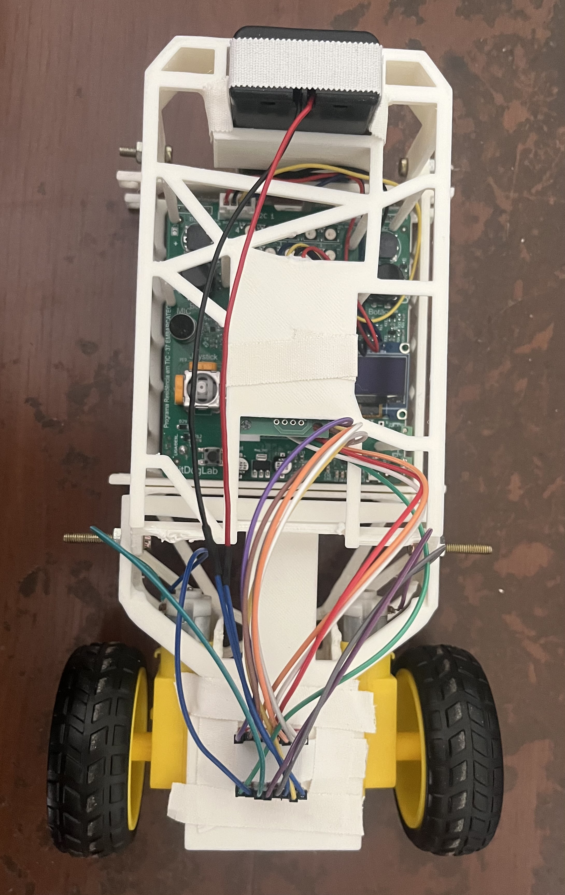
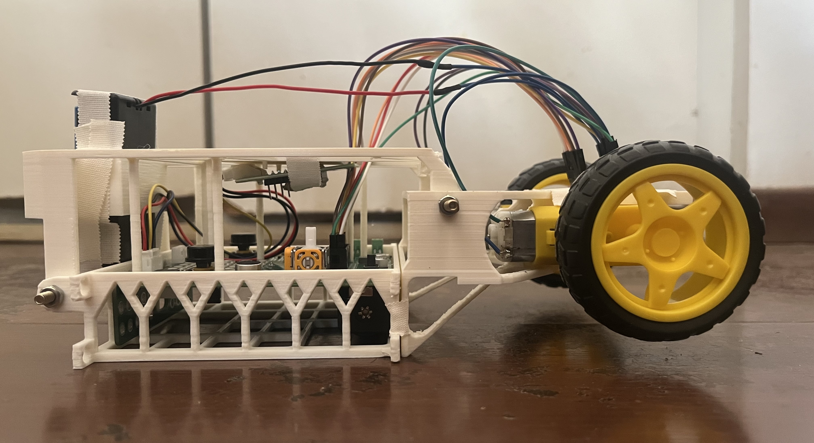
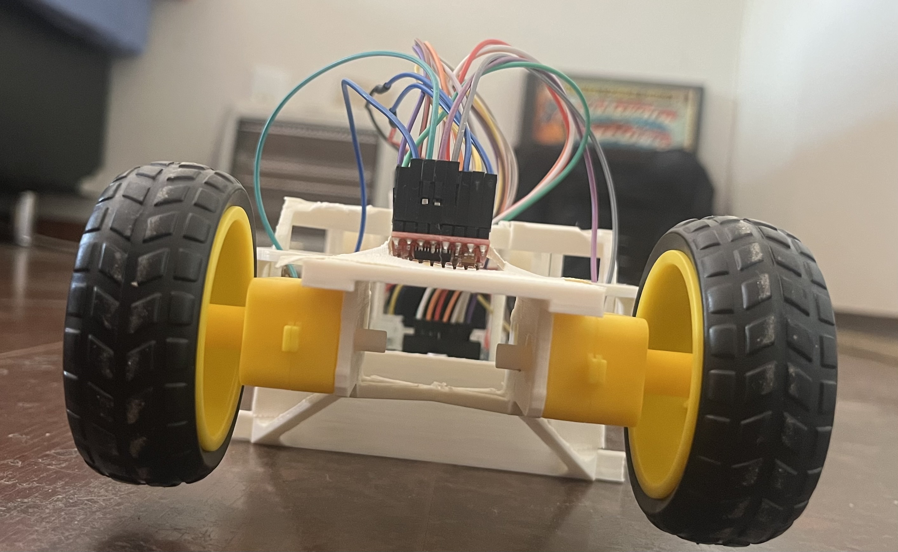
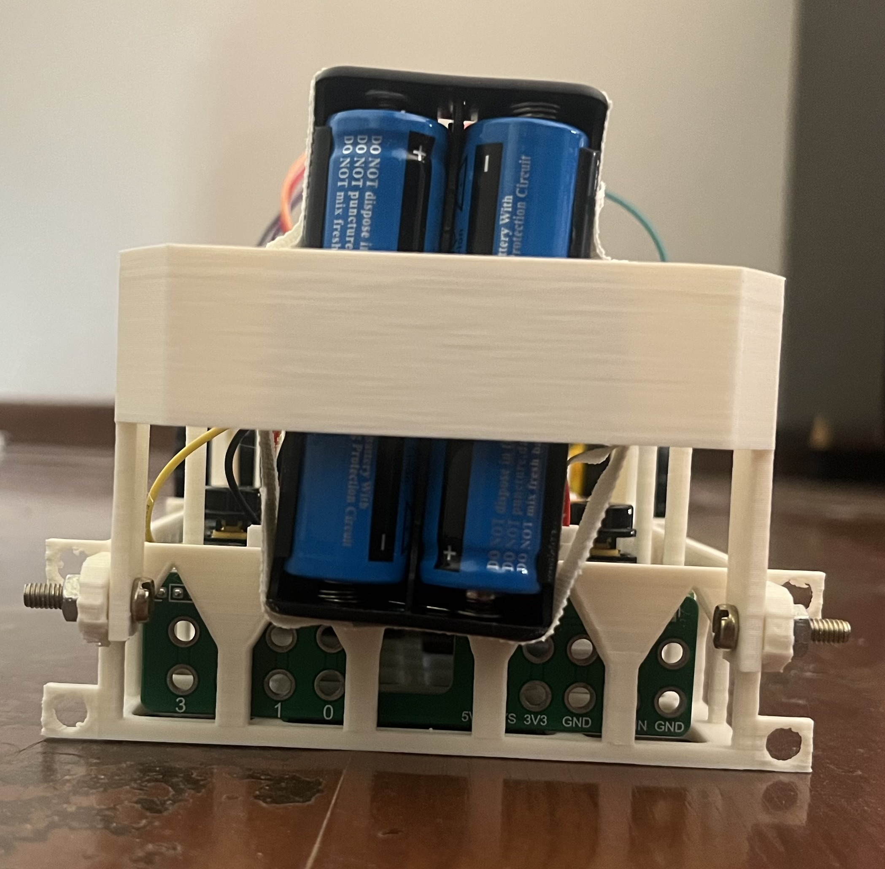
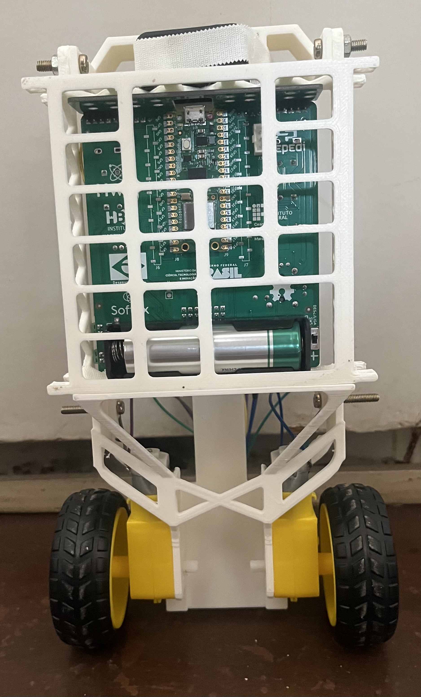

# Projetos de Sistemas Embarcados - EmbarcaTech 2025

Autor: **Davi Henrique Vieira Lima e José Augusto Alves de Moraes**

Curso: Residência Tecnológica em Sistemas Embarcados

Instituição: EmbarcaTech - HBr

Brasília, Agosto de 2025

---
 

# 🚀 Robô Equilibrista
Este projeto foca na aplicação prática de sensores, atuadores e algoritmos de controle, explorando conceitos como leitura de sensores inerciais, Filtro Complementar e o ajuste de um controlador **PID** para resolver um problema clássico de engenharia: "Pêndulo Invertido", por meio do desenvolvimento de um robô móvel de duas rodas com capacidade de autoestabilização dinâmica.

---
 

## 🎯 Objetivo do projeto

Este projeto busca desenvolver um robô móvel de duas rodas com capacidade de autoestabilização dinâmica. Baseado na plataforma **BitDogLab**, o sistema deve resolver o problema clássico do pêndulo invertido, mantendo-se em equilíbrio através de um controle de malha fechada. Entre os objetivos, destacam-se:

* **Integração de Hardware:** Montar e interconectar os componentes essenciais do sistema, incluindo o microcontrolador (Raspberry Pi Pico), um sensor de medição inercial (IMU MPU6050) e os atuadores (motores DC com driver Ponte H).

* **Fusão Sensorial:** Implementar um **Filtro Complementar** para fundir os dados do acelerômetro e do giroscópio. O objetivo é obter uma estimativa de ângulo precisa e estável, superando as limitações individuais de cada sensor (ruído do acelerômetro e desvio/drift do giroscópio).

* **Desenvolvimento de Controle:** Projetar e implementar um algoritmo de controle **PID (Proporcional-Integral-Derivativo)** como o cérebro do robô. Isso inclui o ajuste fino (*tuning*) experimental dos ganhos `KP`, `KI` e `KD` para alcançar uma resposta estável e robusta.

* **Atuação e Acionamento:** Controlar a velocidade e a direção dos motores DC de forma precisa, convertendo a saída do controlador PID em um sinal PWM (Pulse Width Modulation) adequado.

* **Validação Final:** Alcançar um estado de equilíbrio dinâmico observável, onde o robô é capaz de se manter na vertical de forma autônoma e reagir a perturbações externas para manter sua estabilidade.

---
 

## 🧩 Componentes usados

| Item | Descrição                                             | Modelo/Especificação                                       | Qtd |
| :--- | :------------------------------------------------------ | :--------------------------------------------------------- | :-: |
| 1    | Placa Principal                                         | BitDogLab V6.3 com bateria                                 |  1  |
| 2    | Driver de Motor                                         | Ponte H: TB6612FNG             |  1  |
| 3    | Kit Motor e Roda                                        | Motor DC 3-6V com Caixa de Redução + Roda 68mm             |  2  |
| 4    | Bateria dos Motores                                     | LiPo 2S (~7.4V) com conector XT30 ou suporte 2x18650        |  1  |
| 5    | Sensor Inercial (IMU)                                   | Módulo MPU6050                          |  1  |
| 6    | Conector do Sensor                                      | Rabicho com conector I2C macho (4 vias)                    |  1  |
| 7   | Peças Estruturais                                       | Chassi e suportes impressos em 3D                          |  1  |
| 8   | Parafusos (Estrutura)                                   | Philips M3x12mm cabeça chata                               |  4  |
| 9   | Porcas                                                  | Porca sextavada M3                                         |  4  |

---
 

## ⚡ Pinagem dos dispositivos

| Componente                      | Pino na BitDogLab             |
| ------------------------------- | ----------------------------- |
| SDA (MPU6050)                   | GPIO 2                        |
| SCL (MPU6050)                   | GPIO 3                        |
| STDBY (TB6612FNG)               | GPIO 20                       |
| PWMA (TB6612FNG)                | GPIO 8                        |
| INA1 (TB6612FNG)                | GPIO 4                        |
| INA2 (TB6612FNG)                | GPIO 9                        |
| PWMB (TB6612FNG)                | GPIO 16                       |
| INB1 (TB6612FNG)                | GPIO 18                       |
| INB2 (TB6612FNG)                | GPIO 19                       |

---
 

## 📸 Fotos da Montagem

## 🏗️ Etapas Práticas do Desenvolvimento

O desenvolvimento do robô é dividido em etapas incrementais, permitindo testar cada parte do sistema de forma isolada antes de integrá-las.

### 🧪 Etapa 1 - Setup Básico e Testes de Hardware
-   **1a:** Testar a leitura do acelerômetro e giroscópio (MPU6050) e imprimir os dados no terminal.
-   **1b:** Criar um programa para acionar e parar os motores, validando a parte mecânica e elétrica.
-   **1c:** Implementar uma lógica de parada de emergência via botão físico ou detecção de queda.

### 🔢 Etapa 2 - Controle Simplificado
-   **2a:** Acionar os motores com base em um limiar de inclinação do acelerômetro.
-   **2b:** Controlar a potência dos motores de forma proporcional à velocidade angular (giroscópio).

### 🎛️ Etapa 3 - Controle Proporcional (P)
-   **3a:** Determinar experimentalmente a força mínima (`gain`) para que os motores vençam a inércia.
-   **3b:** Implementar um controle onde a força do motor é proporcional ao ângulo de inclinação.
-   **3c:** Adicionar uma "zona morta" (`dead zone`) para evitar acionar os motores com potência insuficiente.
-   **3d:** Aplicar um filtro de suavização para reduzir o ruído do acelerômetro.

### 🧠 Etapa 4 - Controle PID Completo
-   **4a:** Adicionar o **Controle Derivativo (KD)**, que age como um amortecedor para estabilizar as oscilações.
-   **4b:** Introduzir o **Controle Integral (KI)**, que corrige erros persistentes de longo prazo.
-   **4c:** Implementar um **Filtro Complementar** para fundir os dados do acelerômetro e do giroscópio, obtendo uma estimativa de ângulo precisa e estável.
-   **4d:** Integrar os três termos para um **Controle Proporcional-Integral-Derivativo (PID)** completo e realizar o ajuste fino (`tuning`) dos ganhos.

### 🚀 Etapa 5 - Refinamentos e Movimentação
-   **5b:** Definir um ponto de equilíbrio (`setpoint`) para compensar o centro de gravidade real do robô.
-   **5d:** Permitir a movimentação controlada para frente e para trás alterando o `setpoint` dinamicamente.

---

## 🧪 Como compilar e executar

1. **Configuração inicial**  
   Certifique-se de ter o **Raspberry Pi Pico SDK** corretamente instalado no seu sistema, assim como o **CMake** e uma estrutura de projeto compatível.

2. **Clone ou copie os arquivos do projeto**

3. **Monte a estrutura do projeto**

4. **Grave o arquivo `.uf2`** gerado na memória do Pico.

5. **Conecte o Pico via USB segurando o botão BOOTSEL**, monte o disco e copie o `.uf2`.

---
 

## 📈 Resultados esperados ou observados

Ao final do projeto, o robô deverá:

* **Manter o equilíbrio de forma autônoma** em uma superfície plana, com os motores fazendo ajustes contínuos e rápidos para se manter na vertical.
* **Reagir a perturbações**, como empurrões suaves, movendo-se para recuperar o equilíbrio e voltando à posição estável sem grandes oscilações.
* **Permitir movimentação controlada** para frente e para trás, mantendo a estabilidade durante o percurso.

---
 

## 📜 Licença
GNU GPL-3.0.